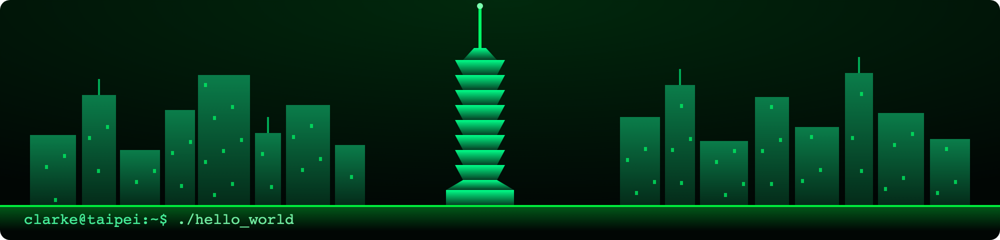

  

&nbsp;

&nbsp;

## `~/tech-stack`

&nbsp;&nbsp;
&nbsp;&nbsp;
&nbsp;&nbsp;
&nbsp;&nbsp;
&nbsp;&nbsp;
&nbsp;&nbsp;

&nbsp;

## `~/featured`

&nbsp;

## `~/github-stats`

&nbsp;

  

&nbsp;

## `~/trophies`

&nbsp;

## `~/now-playing`

&nbsp;

## `~/recent-activity`

<!--START_SECTION:activity-->
1. Pushed to [clarkeforwork-coder/clarkeforwork-coder](https://github.com/clarkeforwork-coder/clarkeforwork-coder)
2. Forked [anuraghazra/github-readme-stats](https://github.com/anuraghazra/github-readme-stats)
3. Starred [CyrisXD/CyrisXD](https://github.com/CyrisXD/CyrisXD)
4. Created branch `main` in [clarkeforwork-coder/clarkeforwork-coder](https://github.com/clarkeforwork-coder/clarkeforwork-coder)
5. Pushed to [clarkeforwork-coder/gmail-auto-classifter](https://github.com/clarkeforwork-coder/gmail-auto-classifter)
6. Created branch `main` in [clarkeforwork-coder/gmail-auto-classifter](https://github.com/clarkeforwork-coder/gmail-auto-classifter)
<!--END_SECTION:activity-->

&nbsp;

## `~/contribution-snake`

&nbsp;

